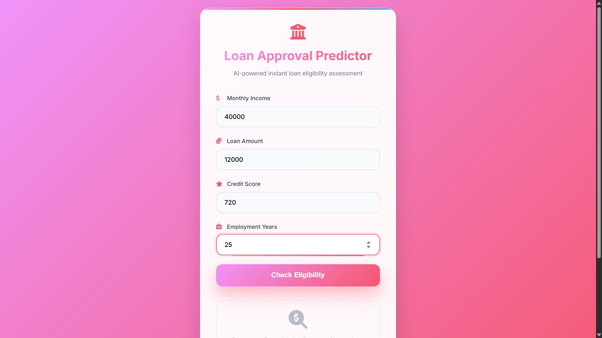
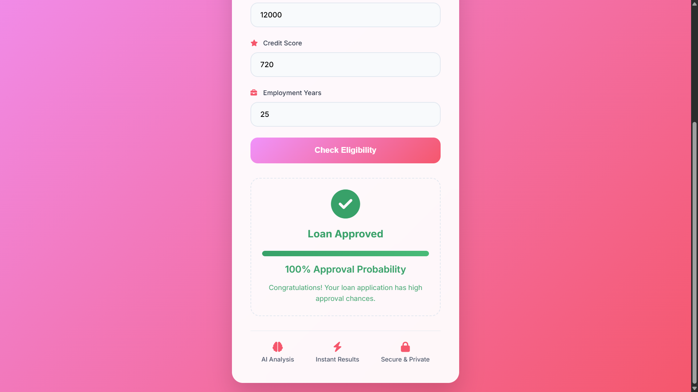

# 🏦 **Loan Approval Predictor**
### *AI-powered instant loan eligibility assessment*

The **Loan Approval Predictor** is an AI-driven web application that evaluates a user's likelihood of loan approval based on key financial and personal factors:

- **Monthly Income**
- **Loan Amount Requested**
- **Credit Score**
- **Years of Employment**

The model analyzes these inputs and instantly returns whether the loan is likely to be **Approved** or **Rejected**, along with the approval probability.

Built with a beautiful modern UI featuring a premium pink gradient design, floating input fields, and an animated eligibility result card.

---

## 🖼 **User Interface Preview**

### 🧾 Input Form  


### ✔️ Eligibility Result  


---

## 🚀 **Features**

### 🏦 **1. AI-Based Loan Eligibility Prediction**
Evaluates eligibility using factors such as:
- Income levels  
- Credit score  
- Loan amount  
- Employment experience  

### ⚡ **2. Instant Real-Time Results**
Displays loan approval status immediately after clicking **Check Eligibility**.

### 🤖 **3. Machine Learning Model**
Built using:
- Scikit-Learn  
- Pandas  
- NumPy  

Supports Logistic Regression / Random Forest classification.

### 🎨 **4. Modern Gradient UI**
Includes:
- Smooth gradients  
- Premium card UI  
- Clean input components  
- Animated approval check badge  

### 🔐 **5. Secure & Local**
All predictions happen locally — no data is uploaded anywhere.

---

## 🛠 **Tech Stack**

### **Frontend**
- HTML  
- CSS / Tailwind  
- JavaScript  

### **Machine Learning**
- Python  
- Scikit-Learn  
- Pandas  
- NumPy  

### **Backend (Optional)**
- Streamlit  
- Flask  


---

## ⚙️ **How to Run**

### **1️⃣ Install Dependencies**
```bash
pip install -r requirements.txt
```

### **2️⃣ Start Application

For Python script:
```bash
python app.py
```
For Streamlit:
```bash
streamlit run app.py
```
---

## 👨‍💻 Author

**Ritesh Mendhe**

Blockchain Developer | Full Stack Developer | Web3 Enthusiast  

LinkedIn  
https://www.linkedin.com/in/ritesh-mendhe-209225294  

GitHub  
https://github.com/riteshmendhe2602  

---

⭐ If you like this project, give it a **star on GitHub**.

